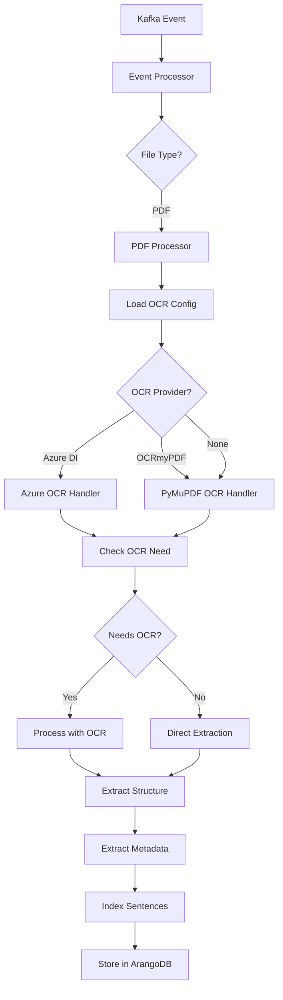

# PDF Processing and Ingestion Workflow - PipesHub AI

## Overview

PipesHub AI implements a sophisticated PDF processing pipeline that handles document ingestion, OCR (Optical Character Recognition), content extraction, and semantic indexing. The system supports multiple OCR providers and intelligently determines when OCR is needed.

## Architecture Components

### 1. OCR Strategy Pattern
The system uses a Strategy pattern for OCR processing, allowing flexible switching between different OCR providers:

- **OCRStrategy** (Abstract Base Class): `app/modules/parsers/pdf/ocr_handler.py`
  - Defines the interface for all OCR implementations
  - Contains `needs_ocr()` method to determine if OCR is required
  - Abstract methods: `load_document()`, `extract_text()`, `process_page()`

- **OCRHandler** (Factory/Facade): `app/modules/parsers/pdf/ocr_handler.py`
  - Creates appropriate OCR strategy based on configuration
  - Provides unified interface for document processing
  - Supported providers: Azure Document Intelligence, OCRmyPDF

### 2. OCR Implementations

#### PyMuPDF + OCRmyPDF Strategy
**File**: `app/modules/parsers/pdf/pymupdf_ocrmypdf_processor.py`

**Key Features**:
- Uses PyMuPDF (fitz) for initial PDF analysis
- Integrates OCRmyPDF for OCR processing when needed
- Custom spaCy tokenizer for intelligent sentence boundary detection
- Block merging algorithm (15-word threshold) for better paragraph formation

**Processing Flow**:
1. Load PDF with PyMuPDF
2. Check each page for OCR requirements
3. If OCR needed, process with OCRmyPDF
4. Extract text blocks, lines, and words
5. Merge lines into sentences using spaCy NLP
6. Create structured output with bounding boxes

#### Azure Document Intelligence Strategy
**File**: `app/modules/parsers/pdf/azure_document_intelligence_processor.py`

**Key Features**:
- Cloud-based OCR using Azure's Document Intelligence service
- Supports multiple document analysis models
- Fallback to PyMuPDF for non-OCR documents
- Advanced paragraph and sentence reconstruction

**Processing Flow**:
1. Initial OCR need assessment using PyMuPDF
2. If OCR needed, submit to Azure Document Intelligence
3. Process Azure response with normalized coordinates
4. Match lines to paragraphs using spatial and content overlap
5. Generate sentences from paragraph lines

### 3. OCR Detection Algorithm

The `needs_ocr()` method determines if a page requires OCR based on:

```python
- Text length < 100 characters
- Significant images (>500x500 pixels) count > 2
- Text density < 0.01 (text area / page area ratio)
- Combination of minimal text AND significant images
```

### 4. Event-Driven Processing

#### Kafka Consumer
**File**: `app/services/kafka_consumer.py`
- Listens for document processing events
- Supports PDF extension type
- Implements concurrency control (max 5 concurrent tasks)
- Rate limiting (2 tasks/second)

#### Event Processor
**File**: `app/events/events.py`
- Downloads files from signed URLs
- Routes PDF files to appropriate processor
- Handles chunked downloads for large files

#### Document Processor
**File**: `app/events/processor.py`

**PDF Processing Method**: `process_pdf_document()`

**Processing Steps**:
1. **Configuration Loading**
   - Retrieves OCR provider settings from configuration service
   - Determines which OCR provider to use (Azure DI or OCRmyPDF)

2. **OCR Handler Initialization**
   - Creates appropriate OCR handler based on configuration
   - Falls back to PyMuPDF if no provider configured

3. **Document Processing**
   - Calls `handler.process_document(pdf_binary)`
   - Extracts paragraphs, sentences, lines, and words

4. **Domain Metadata Extraction**
   - Joins paragraph content
   - Extracts domain-specific metadata
   - Saves metadata to ArangoDB

5. **Sentence Indexing**
   - Prepares sentences with metadata
   - Includes block type, page number, bounding boxes
   - Indexes for semantic search

## Data Structures

### OCR Result Structure
```python
{
    "pages": [
        {
            "page_number": int,
            "width": float,
            "height": float,
            "unit": str,
            "lines": [...],
            "words": [...],
            "tables": [...]
        }
    ],
    "paragraphs": [
        {
            "content": str,
            "bounding_box": [...],
            "page_number": int,
            "block_number": int,
            "metadata": {...}
        }
    ],
    "sentences": [
        {
            "content": str,
            "bounding_box": [...],
            "page_number": int,
            "block_number": int,
            "metadata": {...}
        }
    ],
    "lines": [...],
    "tables": [...],
    "metadata": {...}
}
```

### Bounding Box Format
Normalized coordinates (0-1 range) with 4 points:
```python
[
    {"x": float, "y": float},  # top-left
    {"x": float, "y": float},  # top-right
    {"x": float, "y": float},  # bottom-right
    {"x": float, "y": float}   # bottom-left
]
```

## Configuration

### OCR Provider Configuration
```python
{
    "ocr": [
        {
            "provider": "azure_di",
            "configuration": {
                "endpoint": "https://...",
                "apiKey": "***",
                "model": "prebuilt-document"
            }
        },
        {
            "provider": "ocrmypdf",
            "configuration": {
                "language": "eng"
            }
        }
    ]
}
```

## Processing Pipeline Flow



## Key Features

1. **Intelligent OCR Detection**: Automatically determines if OCR is needed based on text density and image content

2. **Multi-Provider Support**: Flexible architecture supporting multiple OCR providers with easy extensibility

3. **Advanced Text Processing**: 
   - Custom sentence boundary detection
   - Block merging for better paragraph formation
   - Spatial and content-based line-to-paragraph matching

4. **Structured Output**: Maintains document structure with pages, paragraphs, sentences, and precise bounding boxes

5. **Semantic Indexing**: Prepares content for semantic search with rich metadata

6. **Error Handling**: Robust error handling with fallback mechanisms

7. **Performance Optimization**:
   - Chunked file downloads
   - Concurrent processing control
   - Rate limiting

## Extension Points

1. **Adding New OCR Providers**: 
   - Implement `OCRStrategy` abstract class
   - Add provider to `OCRHandler._create_strategy()`
   - Update configuration schema

2. **Custom Text Processing**:
   - Modify spaCy pipeline in `_create_custom_tokenizer()`
   - Adjust sentence boundary rules
   - Customize block merging thresholds

3. **Metadata Extraction**:
   - Extend domain metadata extractor
   - Add custom metadata fields
   - Implement domain-specific rules

## Dependencies

- **PyMuPDF (fitz)**: PDF manipulation and initial analysis
- **OCRmyPDF**: Open-source OCR processing
- **Azure Document Intelligence**: Cloud-based OCR service
- **spaCy**: Natural language processing for sentence detection
- **ArangoDB**: Document storage
- **Kafka**: Event streaming
- **Redis**: Scheduled task management

## Performance Considerations

- OCR processing is computationally intensive
- Azure DI adds network latency but provides better accuracy
- Local OCRmyPDF is faster but may have lower accuracy
- Block merging threshold (15 words) balances granularity vs context
- Concurrent processing limited to prevent resource exhaustion

## Security Considerations

- Signed URLs for secure file downloads
- JWT authentication for API calls
- Sensitive configuration (API keys) stored securely
- Input validation for file types and sizes
- Temporary file cleanup after processing